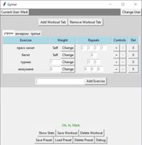
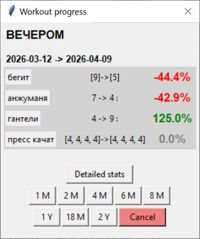
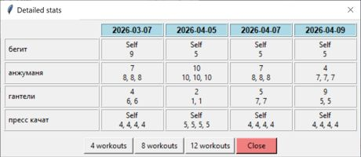

# 🏋️ Gymer - Track Your Workouts

**Gymer** - это десктопное приложение для отслеживания тренировок, созданное на Python с использованием Tkinter и SQLite. Позволяет создавать тренировочные программы, сохранять результаты и отслеживать прогресс.

## ✨ Возможности

### 👤 Управление пользователями
- Создание нескольких пользователей
- Автоматическая загрузка последнего пользователя
- Переключение между пользователями

### 💪 Управление тренировками
- Создание нескольких тренировочных дней (вкладки)
- Добавление/удаление упражнений в каждой тренировке
- Настройка веса (числовой или "Self")
- Настройка количества подходов и повторений

### 💾 Сохранение данных
- Сохранение результатов тренировок в базу данных
- Просмотр истории тренировок

### 📊 Отслеживание прогресса
- Детальная статистика по упражнениям
- Сравнение прогресса за разные периоды
- Выбор периода для анализа (1 месяц, 2 месяца, 6 месяцев, год)
- Отображение изменений в процентах

### 📦 Пресеты тренировок
- Сохранение программ тренировок (пресетов)
- Загрузка ранее сохраненных пресетов
- Автоматическая загрузка данных последней тренировки

## 🖥️ Системные требования

- **Python** 3.7 или выше
- **Операционная система**: Windows / Linux / macOS

## 📦 Установка

### 1. Клонирование репозитория

    bash
    git clone https://github.com/yourusername/gymer.git
    cd gymer

### 2. Установка зависимостей

Проект использует только стандартные библиотеки Python, дополнительная установка не требуется:

    tkinter - для графического интерфейса

    sqlite3 - для работы с базой данных

    json - для сериализации данных

    datetime - для работы с датами

### 3. Запуск приложения

    bash
    
    python main.py

## 🚀 Использование
### Первый запуск

    При первом запуске создайте нового пользователя

    Введите имя пользователя и нажмите "Create New"

    Приложение автоматически создаст две тренировочные вкладки

### Создание тренировки

    Добавление упражнения: Введите название и нажмите "Add Exercise"

    Настройка веса:

        Используйте поле ввода для числовых значений

        Нажмите "Change" для переключения на "Self" (вес тела)

    Настройка повторений:

        Используйте кнопки "+" и "-" для добавления/удаления подходов

        Введите количество повторений в каждом подходе

### Сохранение результатов

    Заполните все упражнения

    Нажмите "Save Workout"

    При необходимости измените дату

    Нажмите "Save"

### Просмотр статистики

    Нажмите "Show Stats" для выбранной тренировки

    Выберите период для анализа (1M, 2M, 6M, 1Y)

    Приложение покажет прогресс по каждому упражнению:

        📈 Зеленый процент - прогресс

        📉 Красный процент - регресс

        ⚪ Серый - без изменений

### Управление пресетами

    Сохранение пресета:

        Настройте тренировочную программу

        Нажмите "Save Preset" и введите название

    Загрузка пресета:

        Нажмите "Load Preset" и выберите сохраненную программу

    Удаление пресета:

        Нажмите "Delete Preset" и выберите пресет для удаления

## 📁 Структура проекта

    
    gymer/
    ├── main.py              # Главный файл приложения
    ├── exercises.py         # Классы для работы с упражнениями
    ├── users.py            # Класс для управления пользователями
    ├── workouts.py         # Класс для управления тренировками
    ├── presets.py          # Класс для управления пресетами
    ├── debugs.py            # Отладочные функции
    │
    ├── screenshots/          
    │   ├── main_window.jpg
    │   ├── stats_window.jpg
    │   └── detailed_stats.jpg
    │
    └── user_data.db

## 🗄️ База данных

Приложение использует SQLite для хранения данных. Основные таблицы:

    users - информация о пользователях

    saved_workouts - сохраненные тренировки

    presets - сохраненные пресеты

    workout_data - данные упражнений в пресетах

    last_user_data - последний пользователь

## 📄 Лицензия

Этот проект распространяется под лицензией MIT. Подробности в файле LICENSE.

## 📸 Скриншоты

